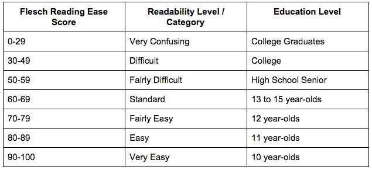

# Data structuring and analysis of Los Angeles job postings

The goal of the project is to structure the textual data from over 600 individual job postings into a tabular dataset. Upon the completion of the structuring and cleaning of the dataset, an exploratory analysis will be undertaken to gather and visualize any possible insights.

The complete notebook can be accessed [here](https://nbviewer.jupyter.org/github/omglu93/boston_crime_EDA/blob/master/boston-crime-eda-1-3.ipynb).

# EDA questions

The questions I want to answer are:

- What is the lowest income over time?
- What is the highest income over time?
- When are the most opportunities open and what are the general deadlines?
- What are the most paid jobs and least paid jobs in LA?
- What are the most frequent tasks in the selection process?

# Primary goal : TF-IDF

After completing the exploratory analysis the primary goal is to construct a similarity function to find similar jobs to the one selected. The similarity function was created using a TfidfVectorizer from the sklearn library. This class converts the selected documents into a TF-IDF matrix. TF-IDF term frequency–inverse document frequency is often used in numerical statistics to determine the importance of words. Its most frequent use is in search engines where it is used to score and rank documents based on the user's query. In this particular case, the function using TF-IDF will find the most similar job for the one selected.

# Secondary goal : Flesch-Kincaid readability

The secondary goal is to create a Flesch-Kincaid readability test using the requirements and duties collected from the textual data. The test is used to determine how difficult a passage in English is to understand. In this case, we are going to use the Flesch–Kincaid Grade Level.

# Dataset

The data is provided by the City of Los Angeles.

- 683 textual documents

# Requirements
- Python 2.7 or Python 3.6
- Jupyter Notebook

# License
MIT. See the LICENSE file for the copyright notice.
